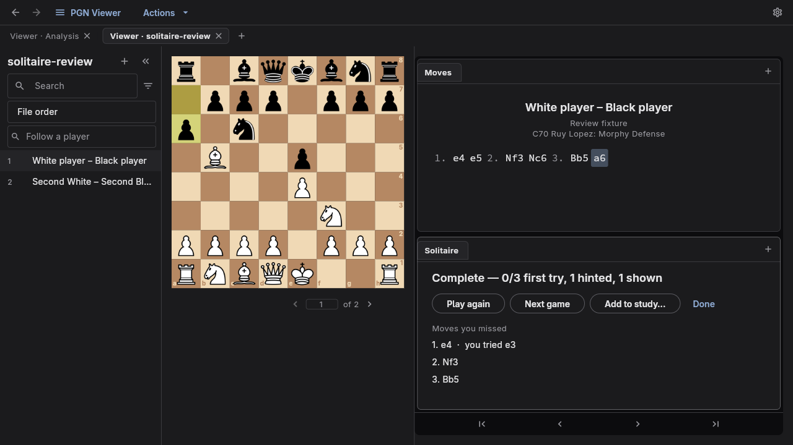

Method: dual-agent (A: /root/design_review · B: /root/detector_evidence). Assessment A finished before detector results entered synthesis.

Solitaire Chess is a solid first version of historical-move guessing, but a basic training tool. The core interaction works; the biggest opportunity is to help players understand and retain what they learned. Reviewed source at 8568aaf0848f0636ba9ef60a8a9e6a81d58afd72, native Linux app at 1280×720 with disposable games, the linked article, and the live GuessTheMove trainer. No application changes were made.

## Design specificity and strengths

The board, charcoal workspace, familiar movetext and in-place practice pane fit Chess Auto Prep's Quiet Analysis Room. Preserve this identity. More decoration would not improve the exercise.

- The complete basic loop exists: choose White/Black, start at the beginning/current position, guess, receive an automatic reply, request a piece hint, reveal, finish, replay and inspect missed moves.
- Spoiler protection reaches the move tree, notes, arrows, explorer, review graph and engine controls. Wrong guesses leave the source PGN unchanged.
- Feedback slots keep controls still, and “Not the game move” accurately describes historical matching without explicitly declaring the alternative bad.

## Comparison

| Capability | Chess Auto Prep Solitaire | GuessTheMove |
|---|---|---|
| Evaluate guesses | Exact mainline match | Engine credit for good alternatives |
| Score | First-try, hinted and shown counts | First-attempt points, weighted moves and partial credit |
| Retain thinking | In-memory attempted moves; Add to study copies the game | Notes and analysis variations; annotated PGN/PDF export |
| Starting point | Beginning or current position, mainline only | Move number and opening-book suggestion |
| Session options | White or Black, untimed | Own-PGN side options include both; optional clocks |
| Content | The PGN already open in the workspace | Built-in master-game library and own PGN |

GuessTheMove documents engine-based alternative credit, first-attempt scoring, and preanalysis of its library. Its rating bands and par are estimates; I would not copy them as a credible rating measurement without calibration. [Scoring documentation](https://guessthemove.net/scoring)

Its homepage describes clocks, both-side practice, notes, exports and a curated library. [Feature overview](https://guessthemove.net/)

In the live trainer, a wrong 4.f3 guess opened a notes/variation dialog and disclosed 4.e3 while the underlying status still said “try again.” Keep the reflection capability, but prefer an optional inline note over an interrupting dialog. At the inspected browser size, the board and useful status controls did not all fit vertically. The author also acknowledges unreliable opening-book lookup. [Introducing GuessTheMove](https://ontheroadtochessmaster.substack.com/p/introducing-guessthemovenet)

## Priority improvements

1. **P2 — Separate matching the game from finding a good move.** The current controller accepts only the mainline node (`lib/workspace/solitaire.dart:168`). Keep exact-match practice available; add engine assessment after submitting a guess. Distinguish “Game move,” “Good alternative,” and “Mistake,” then continue along the actual game. Keep first-attempt quality separate from assisted completion. If analysis is pending, show that honestly. This is the largest training improvement. Design command: impeccable shape.

2. **P2 — Preserve a useful session review.** Guesses currently live in memory, while Add to study passes the ordinary game draft (`lib/app/mode_view.dart:555`). Store attempts, assistance and optional reasoning separately from the source PGN, support resume, and offer an annotated study copy. Make “Review decisions” the clear completion action, with “Retry missed positions” afterward. Separate hinted, revealed and attempted moves instead of labelling all of them “missed.” Design commands: impeccable shape, clarify.

3. **P2 — Fix interaction edge cases before adding complex scoring.** `showHint()` lacks the reply/side guard used by `play()` and `reveal()` (`lib/workspace/solitaire.dart:189`); during the 400 ms opponent reply it can count a hint for the wrong side. This is source evidence, not a timed live reproduction. Disable dependent actions and guard the controller. Also test returning to earlier revealed positions: the visible cursor may differ from the frontier against which guesses are judged. Provide “Return to current guess” or stop accepting guesses until that position is displayed. Design command: impeccable harden.

4. **P2 — Make progress and the next action obvious.** Show “Move 8 of 24 · White to play,” with completed, unaided and revealed counts named literally. “Guessed” currently includes Show move; a hint removes first-try credit without explaining it. Use explicit review rows showing game move, attempted move and assistance. Keep a stable feedback area, but let it expand with larger text. Test text scaling and screen-reader announcements; fixed 20-pixel feedback slots are a source risk, not a proven accessibility failure. Design commands: impeccable clarify, adapt, polish.

5. **P2 — Make setup match the position the player expects.** Live inspection confirmed that choosing Black leaves White at the bottom. Orient to the chosen side while preserving manual flip. Rename “Move 1” to “Beginning” for FEN-start games and “This move” to “Current position”; show the actual starting move. On a sideline, explain that the current implementation retreats to its mainline branch point. Design command: impeccable clarify, polish.

Add optional clocks, both-side practice and opening-skip suggestions after these. Any opening suggestion should show its source and remain editable. Reuse the existing PGN Viewer and study flow rather than building a separate trainer shell.

## Design health

Scores are expert judgments on a 0–4 scale, not measured usability outcomes.

| Heuristic | Score | Main observation |
|---|---:|---|
| System status | 3 | Feedback works; total disappears during play |
| Match with chess language | 3 | Clear language; “guessed” is misleading |
| Control and freedom | 3 | Stop/Esc/replay; no session resume |
| Consistency | 3 | Shared controls; Black choice does not orient board |
| Error prevention | 3 | Strong concealment; reply-hint and start edge cases |
| Recognition | 2 | Hidden scoring implications and weak review affordance |
| Efficiency | 3 | Quick board loop; no registered Hint/Reveal shortcuts |
| Aesthetic restraint | 3 | Calm, specific; completion lacks a dominant next action |
| Recovery | 3 | Retry, Hint and Show move keep users moving |
| Help | 2 | Setup explains task; score/start semantics need explanation |
| **Total** | **28/40** | **Good foundation; incomplete training experience** |

## Cognitive load and emotional journey

Moderate load: two of eight checklist items fail—remembering the original total, and interpreting the completion hierarchy. The activity itself stays within four choices per stage; the broader Actions menu is grouped and should not be confused with the practice flow. Setup is approachable, misses are recoverable, and success is calm. Completion gives too little guidance on what to learn next.

## Persona checks and smaller observations

- A tournament player practicing Black must manually flip after selecting Black.
- A first-time user cannot easily infer hint scoring or that plain-text missed moves are clickable.
- A keyboard-heavy player lacks registered Hint/Reveal shortcuts. Existing accessible-board support must be retained; do not mistake this gap for a wholly inaccessible app.
- A player studying an annotated variation may start earlier than expected because practice follows the mainline.
- The initial “No moves” message describes concealed moves poorly; omission may be clearer. Summary notation should use the established move typography.
- Narrow windows, enlarged text and screen readers were not exercised; they require focused validation.

## Verification and detector evidence

The native review exercised setup, wrong/correct guesses, automatic replies, hint, reveal, summary, stopping and Black selection with disposable data. The two focused files `test/workspace/solitaire_test.dart` and `test/app/viewer_book_reading_test.dart` passed all eight tests. Existing tests cover the basic contract, not the edge cases above. A duplicate eight-test run was inadvertently submitted by the independent reviewer and also passed; it adds no distinct coverage. No full suite or engine-quality benchmark was run.

The independent detector returned exit 0 and `[]`: zero primary/advisory findings and no false positives. Its non-HTML matching cannot validate native Flutter layout or accessibility. No ignore file was present. Native screenshots and source inspection supply the useful evidence; no browser DOM overlay applies to this desktop pane.

## Decisions for the next pass

- Start with interaction/progress fixes, engine-aware feedback, or saved session review?
- Keep historical-move matching as the default, or make engine-assessed move quality the default with matching as an option?

The recommended order is correctness and progress, saved review, then engine scoring; clocks and richer selection follow later.

