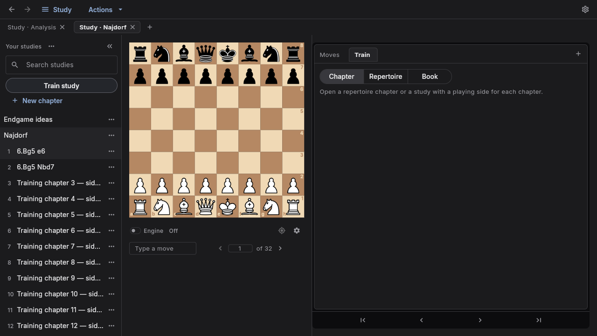
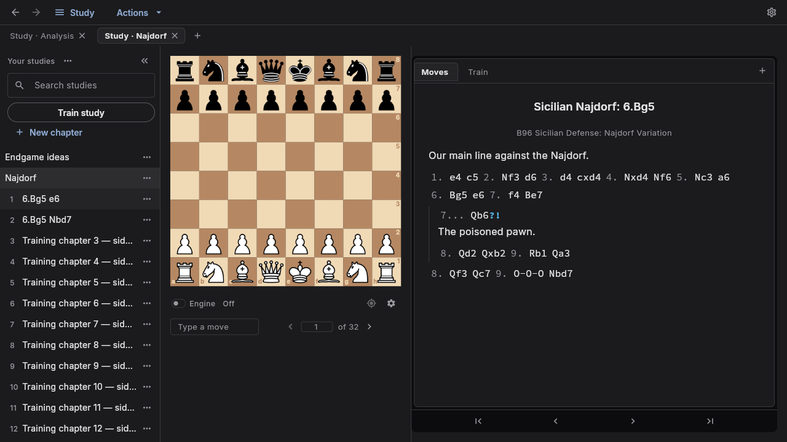

Method: dual-agent (A: /root/study_design_review · B: /root/study_evidence_review).

# Studies usability and lila parity — 2026-10-02

**No: we do not have full Lichess Studies parity, and common study-authoring workflows are not yet equally usable.** We have a capable local reader/editor and useful preparation integration. The largest opportunity is making existing capabilities discoverable and connected.

Compared Chess Auto Prep application code at f7d85a5bf21aba53e9d7afc615c3ddbc2d843917 with saved lila at e3f1982528. Main advanced to d1c5a263 during review, changing instructions only. Six native screenshots at 1280×720 covered empty, loaded, chapter menu, Train, annotation editing and chapter creation. The sample used the repository's Lichess PGN fixture, extended to 32 chapters in a disposable profile. This is a heuristic review, not measured user research or a percentage of feature parity.

## Design specificity and strengths

Keep the current visual identity: the prominent board, restrained charcoal shell, readable notation, inline comments and variation guides fit sustained chess preparation. The annotation editor is useful once discovered and shows saved state. Simple chapter creation progressively reveals the board editor. Undo, collision-safe imports, destructive confirmations and recovery storage are meaningful foundations.

## Workflow parity

| Workflow | Assessment |
|---|---|
| Read chapters, navigate moves, inspect variations | Substantial foundation; familiar board and reading layout |
| Edit moves, comments, shapes and glyphs | Present; annotation discovery is weaker, glyph authoring is narrower |
| Create a chapter from a position | Present, with board editor and FEN |
| Find and reorganize many chapters | Behind: study-name search only, repeated Move up/down actions |
| Import PGN / Lichess study | Present; direct append-to-current-study and pasted-PGN chapter creation are missing from Study's import UI |
| Practice stored study lines | Present, with quiz markers; imported metadata can block entry without a direct repair |
| Author interactive lessons / hide-next-moves / practice against computer | No equivalent set of Lichess chapter modes; line training is a different workflow |
| Share links, embed, collaborate live, member permissions and chat | No equivalent Study workflow; PGN export is the current sharing route |
| Local file ownership and preparation integration | A product strength worth preserving |

Lila evidence: [chapter creation and modes](/home/anbernal/Projects/lila/ui/analyse/src/study/chapterNewForm.ts:39), [chapter search](/home/anbernal/Projects/lila/ui/analyse/src/study/studySearch.ts:25), [reordering](/home/anbernal/Projects/lila/ui/analyse/src/study/studyChapters.ts:164), [sharing](/home/anbernal/Projects/lila/ui/analyse/src/study/studyShare.ts:97), [permissions](/home/anbernal/Projects/lila/modules/study/src/main/Settings.scala:3), [lesson authoring](/home/anbernal/Projects/lila/ui/analyse/src/study/gamebook/gamebookEdit.ts:18). These refer to the saved checkout, not a live lichess.org comparison.

## Priorities

### P1 — Make Train study reliably lead to practice

Observed: the fixture opens normally, but Train study says to open a study with a playing side for every chapter. It offers no repair and displays Chapter / Repertoire / Book controls.

Cause: [trainer.dart:728](/home/anbernal/Projects/Chess-Auto-Prep/lib/features/trainer/trainer.dart:728) requires [sidesPerChapter](/home/anbernal/Projects/Chess-Auto-Prep/lib/chess/pgn/study.dart:79): a study name and explicit Orientation tags in every chapter. The board has a visual orientation fallback, so the displayed board gives no indication of missing training metadata. This does not mean all Lichess imports fail.

Provide Choose training side directly in Train, apply-to-all with chapter exceptions, and Chapter / Whole study scope. Explain which chapters need a choice and allow ready chapters to proceed. Separate temporary board flipping from the side being practiced. Validate an imported PGN with missing tags and a mixed-side study.

Suggested skill: impeccable harden, then clarify.

### P1 — Put annotation beside the move being studied

Comments and six move-quality glyphs work after Actions → Edit or Ctrl+E, but the reading screen lacks an obvious annotation entry. Lila exposes comment/glyph tools and a comment action in the move menu.

Add a quiet Annotate control beside Moves, Comment this move in the context menu, and a keyboard route to the same actions. Preserve the current editor and stable reading layout. See [edit strip](/home/anbernal/Projects/Chess-Auto-Prep/lib/workspace/edit_strip.dart:182) and [lila context actions](/home/anbernal/Projects/lila/ui/analyse/src/study/studyView.ts:127).

Suggested skill: impeccable clarify.

### P1 for large studies — Make chapters findable and movable

The 32-chapter capture shows repeated truncated titles. Search studies matches only file names; chapters share a scrolling list with other studies. Reordering uses an eleven-action menu with Move up/down, one step at a time.

Show the current study as the sidebar context, search its chapters, expose full titles on hover/focus, retain the active row in view, and add drag reorder plus keyboard-accessible Move to position. Keep existing arrow-key and numeric chapter navigation. Group the chapter menu by purpose. Evidence: [search](/home/anbernal/Projects/Chess-Auto-Prep/lib/features/study/studies.dart:92), [list](/home/anbernal/Projects/Chess-Auto-Prep/lib/features/study/study_panel.dart:351), [menu](/home/anbernal/Projects/Chess-Auto-Prep/lib/features/study/study_panel.dart:702).

Suggested skill: impeccable shape, then distill.

### P2 — Import into the intended study

The empty state suggests Lichess import but exposes PGN import; URL import is in the ellipsis menu. New chapter offers Initial / Position only. Both Study import methods create a new study. Cross-mode Add to study exists, but does not provide this direct authoring flow.

Offer a visible Import action accepting file, pasted PGN or supported URL, with destination New study / Add chapters to current study. Preview chapter count and preserve collision protection. Evidence: [import methods](/home/anbernal/Projects/Chess-Auto-Prep/lib/features/study/studies.dart:251), [chapter form](/home/anbernal/Projects/Chess-Auto-Prep/lib/features/study/new_chapter_dialog.dart:36).

Suggested skill: impeccable shape.

### P2 — Expand study authoring in a deliberate order

First add common positional glyphs and visible quiz start/end controls. Then consider lesson hints, wrong-move feedback and learner preview. Lila's gamebook authoring has explicit hint and deviation content; our quiz markers are not an equivalent lesson format.

Keep collaboration, permissions and hosted sharing as a separate product decision. For personal preparation, the four workflow repairs above offer a clearer immediate benefit. Evidence: [glyph editor](/home/anbernal/Projects/Chess-Auto-Prep/lib/workspace/edit_strip.dart:375), [quiz menu](/home/anbernal/Projects/Chess-Auto-Prep/lib/features/study/study_panel.dart:853), [lila gamebook](/home/anbernal/Projects/lila/ui/analyse/src/study/gamebook/gamebookEdit.ts:18).

Suggested skill: impeccable shape; finish implemented work with polish.

## Design health

Scores are subjective heuristic judgments, not usability-test measurements.

| Nielsen heuristic | /4 | Main observation |
|---|---:|---|
| System status | 3 | Good selection/save state; some successful actions are quiet |
| Match to real-world language | 3 | Chess language is good; playing side/orientation and game/chapter diverge |
| Control and freedom | 3 | Undo, Cancel and navigation history |
| Consistency | 2 | Actions scattered across several menus |
| Error prevention | 3 | Good file safeguards; training prerequisites unresolved |
| Recognition over recall | 2 | Editing and quiz authoring require menu knowledge |
| Flexibility and efficiency | 2 | Useful shortcuts; chapter search/reordering weak |
| Aesthetic minimalism | 3 | Calm reading, crowded chapter menu |
| Error recovery | 2 | Training error lacks a direct repair |
| Help and documentation | 2 | Tooltips exist; contextual study guidance is thin |
| **Total** | **25/40** | **Useful foundation with significant workflow friction** |

## Cognitive load, personas and secondary observations

Reading and chapter creation have clear grouping. The eleven consecutive chapter-menu actions and spread across global, study, chapter and move menus increase recall demands. Opening an annotated chapter is reassuring; pressing Train and reaching an unrepairable prerequisite message is the main emotional low point.

A new author may mistake comments for read-only content. An experienced Lichess user will notice slower chapter navigation and importing. A keyboard-dependent player benefits from navigation shortcuts but needs an explicit route to move context actions. Screen-reader behavior was not tested.

The existing [study documentation](/home/anbernal/Projects/Chess-Auto-Prep/docs/v2/features/study.md) describes chapter search, drag reordering and import options absent from the current Study panel. Correct the documentation alongside implementation. Narrow layouts and text scaling need a dedicated follow-up verification; this review did not exercise them live.

Additional evidence from reviewer B: deleted studies go to recovery storage, but the Study panel offers no visible Deleted studies / Restore route. Add a recovery action near the deletion result. Study/chapter rows also need explicit selected-state semantics, and asynchronous status messages need appropriate announcements. These are source findings, not observed screen-reader failures. The shared accessible board already has keyboard and semantic support.

## Evidence and limits

The detector ran successfully against lib/features/study and returned []: zero primary/advisory findings. It did not report a scanned-file count, so Dart coverage is unverified; this is not Flutter accessibility or layout clearance. No false positives; no critique ignore file was present.

Independent source/visual assessment A finished before detector assessment B entered synthesis. Native Flutter screenshots replaced browser inspection; there is no web DOM or browser overlay for this target. The headless preview was stopped, and no real user databases were used. No application behavior changed in this audit.

Questions skipped: the repository's current owner instructions permit at most one truly blocking question and prohibit a closing questionnaire; sub-agent authorization was already answered. The recommended default is improving solo preparation workflows in the order above.
