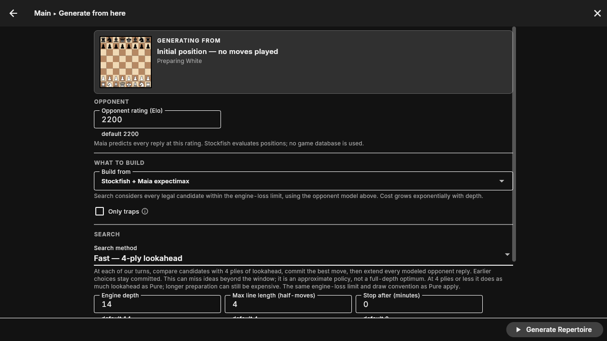
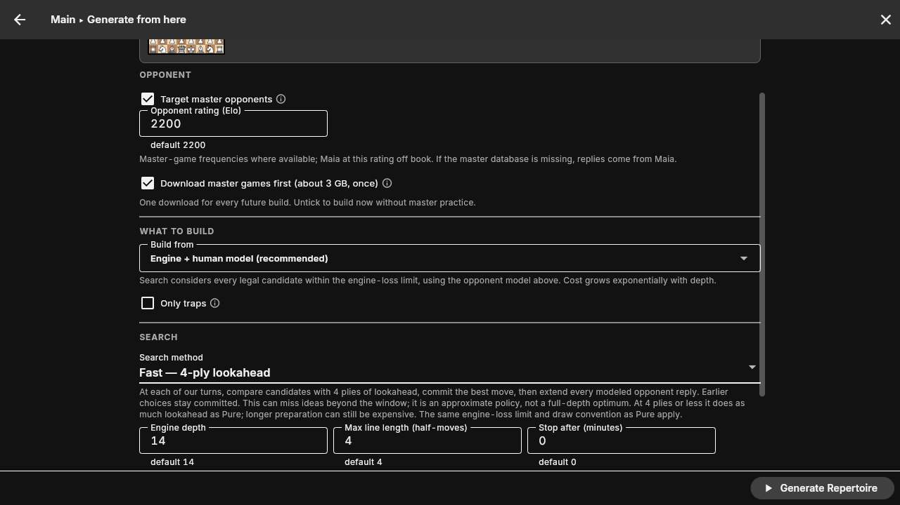

# Fast versus Pure

The app calls the four-ply rolling method **Fast**. Pure remains the default.
Fast completes a four-ply comparison, commits our next move, and repeats for
all modeled opponent replies. It can save our alternative branches beyond
that window, but does not make opponent branching cheap. At four plies or less,
there is no shorter lookahead to exploit.

## Maia-only verification — 6 September 2026

Pure and Fast now use Stockfish evaluations and Maia probabilities throughout.
The build form has no master-targeting or download controls for expectimax.
Legacy master-enabled presets and CLI flags cannot re-enable database access.

- 732 focused Dart generation, form and session tests passed; analyzer and lint passed.
- C checks passed: 30 Pure oracle trees, 12 rolling oracle policies, builder and
  CLI regressions, including real Maia in both modes with legacy master flags.
- 45 MCP tests and two benchmark reporting/storage checks passed.
- A real Stockfish + Maia pawn-control smoke run (4 plies, engine depth 4)
  completed in both modes: 852 nodes, Kf1, value 0.5416864443517625. Build times
  were 5.050 seconds for Pure and 5.209 seconds for Fast. At this horizon both
  perform the same search; this is a correctness smoke check, not evidence of
  speedup at longer horizons.
- The Pure and Fast forms were inspected in the headless app.



## Historical measurements — 5 September 2026

These runs predate the Maia-only change. Their master-opening results describe
the earlier master-book/Maia policy. The current harness uses Maia throughout;
rerunning it does not reproduce that earlier opponent model. The pawn cases
were already Maia-only.

Stockfish 18, depth 8; Maia model and binary checksums and effective configs
are preserved in the [measurement data](benchmarks/fast-pure-2026-09-05.json).
The read-only local master book contained 1,920,172 games. These timings use
the Dart implementation. C is covered by the same independent algorithm
oracles and CLI regression tests; these are not C timing measurements.

| Position | Horizon | Pure | Fast | Outcome |
|---|---:|---:|---:|---|
| Pawn control | 4 plies | 18.85 s | 19.83 s | Both complete; same policy and value |
| Pawn follow-up | 6 plies | 188.35 s | 89.88 s | Both complete; different first moves |
| Italian after 1.e4 e5 2.Nf3 Nc6 3.Bc4 Bc5 | 6 plies | 90 s cap | 90 s cap | Both incomplete |
| QGD after 1.d4 d5 2.c4 e6 3.Nc3 Nf6 | 6 plies | 90 s cap | 90 s cap | Both incomplete |

The pawn position is `8/8/8/8/8/4k3/P7/4K3 w - - 0 1`, with White preparing.
At four plies, both built 860 nodes and chose Kf1. Fast did a few extra
intermediate evaluations; there is no horizon saving at that length.

At six plies, Fast built **11,029 nodes** versus Pure's **30,945** (64.4% fewer),
and made 11,314 versus 31,390 engine calls. It was **2.10× faster in the
completed follow-up pair**. Fast chose **Kf1**; Pure chose **Kd1**. The values
were 0.755726 and 0.764449, respectively. Their difference is not a calibrated
win-rate loss, and is not algorithmic regret under shared frozen evaluations.

The initial six-ply pawn pair used a 90-second cap: Fast finished in 73.37 s,
while Pure was incomplete at 90.03 s. The longer follow-up used a 600-second
cap for both, reproduced Fast's exact tree, policy value and engine-call count,
and let Pure finish. The 73–90 s variation in Fast's two timings shows why a
single multiplier should not be generalized. The initial eight runs and the
follow-up are all preserved, including incomplete runs.

Both opening cases actually used master-book replies and Maia fallback.
Neither completed within 90 s, so **these tests establish no completed-search
speedup in master openings**. In the QGD, Fast had not even completed its first
four-ply comparison and correctly left the root move unresolved. In the
Italian, it committed Nc3 but still had incomplete preparation afterward.
The pawn case was entirely off-book; it is not representative evidence about
preparing against masters.

The measured tradeoff supports offering Fast as an explicitly approximate
option while keeping Pure as the reference and default. “Fast” does not mean
instant or equivalent to full-horizon search.

## Reproduce

Run from a prepared checkout with Stockfish and Maia installed:

```sh
tools/experiments/fast_vs_pure/run_overnight.sh /tmp/fast-pure-results \
  --depth 8 --seconds 90 \
  --onnx-lib build/linux/x64/debug/bundle/lib
```

The historical `run_overnight.sh` name now dispatches a bounded, paired
benchmark. It no longer invokes the retired Fast heuristics or old comparison
metrics. Use `--case pawn-six --seconds 600` for a longer follow-up. Output
must be a fresh directory; it refuses to reuse an individual run's storage.
No master database is required or opened. No network is used.

Each run launches a fresh Flutter test process and Stockfish worker, with
isolated app storage. It uses the production Dart `TreeBuildService`, fixed
Stockfish depth 8, one engine thread, a 40 cp loss constraint, and Maia 2200
throughout. Model and process startup are
measured separately and excluded from build time. Run order alternates by
case. The cap is cooperative; an atomic operation can finish just after it.

Every run saves its config, completion status, value bounds, nodes, engine
calls, book hits/misses, full-history move choices, and tree. The comparison
suppresses speedup ratios when either build is incomplete. Complete Fast bounds
certify its committed policy value within the declared model, not Pure's
full-horizon optimum.

## Interpretation

These are local latency observations, not chess-strength tests or statistical
speed guarantees. Stockfish reuses its hash within each run; different tree
traversals can yield different fixed-depth evaluations and candidate sets.
Consequently, subtracting the independently measured root scores does **not**
estimate algorithmic regret. Root-move agreement is only descriptive.

The [independent eight-ply algorithm tests](ROLLING_SEARCH_AND_STUDY_LINES.md#checks-and-measured-limits)
use fixed inputs to check both implementations against a separate oracle.
They deliberately include positions in synthetic trees where committing to
a short lookahead loses value. Fast's approximation is explicit in the form,
result text and exported PGNs.

Existing output is never overwritten. Its reporting and storage guards have
an engine-free check:

```sh
scripts/ci.sh with -- python3 tools/experiments/fast_vs_pure/test_benchmark.py
```

## Historical verification

- 47 focused Dart tests passed, including the independent Pure and rolling
  oracles, legal expansions, configuration migration, and visible Fast label.
- C passed 30 Pure oracle trees, 12 rolling oracle trees, legal-builder checks,
  both `--search fast` and `--search rolling`, and mode-preserving PGN export.
- 44 MCP tests and three benchmark-reporting/storage tests passed.
- Dart analysis and repository lint passed. The native build passed with
  existing compiler warnings. The full repository suite was not rerun for this
  naming and benchmark change.

The headless 1280×720 app check selected Fast, inspected the explanation and
summary, and deselected **Target master opponents**, which changed the model
description to Maia throughout. No Flutter exceptions or overflow messages
appeared. The test used disposable app data.



[Fast settings and summary](images/fast-search.png)
