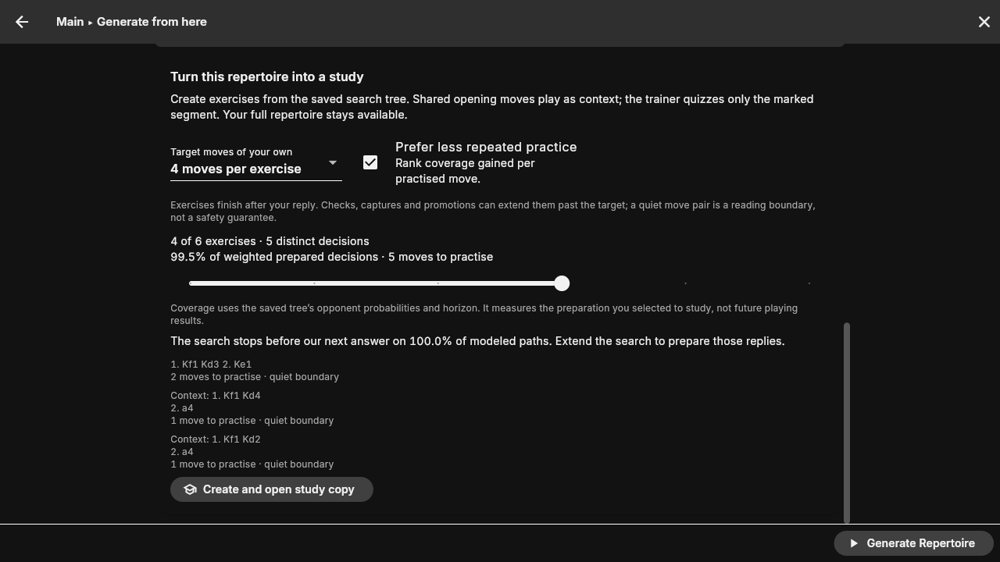

# Fast search and study lines

Pure remains the default and the reference algorithm. The optional **Fast — 4-ply lookahead** mode reduces repeated exploration of our alternatives.
Both Dart and C implement it. Memorability belongs in the separate study plan;
it never changes a search value, legal candidate set, or opponent probability.

## Why this version of faster search

At each of our decisions:

1. Search every admissible move and every positive-probability opponent reply
   through four more plies, or the requested final horizon if closer.
2. Complete that comparison before committing our next move. Keep its UCI,
   absolute comparison horizon, and comparison value in the saved tree.
3. Continue every modeled opponent reply after that move. At each resulting
   decision, repeat the four-ply comparison. Previously searched nodes are reused.

This chooses **one of our moves**, not a single predicted sequence of opponent
moves. Stopping the other opponent branches would replace an expectation with
an optimistic path. Stopping at the first sufficiently tricky candidate would
also make the result depend on move enumeration and a new arbitrary threshold.
Neither behavior is implemented.

This is limited lookahead with a receding horizon. It can miss a refutation or
benefit beyond its window. The MIT [dynamic programming lecture on limited
lookahead and rollout](https://ocw.mit.edu/courses/6-231-dynamic-programming-and-stochastic-control-fall-2015/resources/mit6_231f15_lec8/)
explains both the exponential cost of lookahead and the importance of its
terminal approximation. Rollout policy-improvement results require additional
conditions on a base policy and its value approximation; our Stockfish leaf
proxy does not establish those conditions. **This is not a guaranteed policy
improvement over Pure or a proven chess-strength improvement.**

Exact speedups remain a separate direction. Ballard's [1983 chance-tree search
paper](https://www.sciencedirect.com/science/article/abs/pii/S0004370283800150)
introduces bounded pruning of chance trees. Such pruning requires valid bounds;
a position merely looking good is not a valid pruning certificate.

The opponent model, engine-loss constraint, fixed engine depth, history, draw
convention and leaf utility are identical to [Pure](ALGORITHM.md). Four plies
is fixed for this first implementation; it is not another tuning panel. The
preparation horizon still controls how far the resulting policy continues.

## Values, interruption and resume

A saved Rolling comparison value answers: “Which next move won this completed
short comparison?” The final expected-score value instead evaluates the
**committed policy** to the requested preparation horizon. It does not maximize
again over siblings searched to different depths. The MCP response puts the
committed move first and suppresses an invalid margin over those siblings.

A budget stop cannot commit an unfinished comparison. Uncommitted own decisions
are unresolved, with bounds [0,1], and are not exported as guessed repertoire
moves. Completed local commitments can appear in incomplete preparation; the
UI labels the result incomplete. Equal final bounds describe the committed
finite policy, not the best possible full-horizon policy or true chess strength.

Resume retains commitments whose four-ply windows were complete. Increasing the
preparation horizon reopens a decision if its old comparison had stopped short
of four plies at the old horizon. Pure and Rolling cannot be interchanged on an
existing tree. Start a fresh build to compare methods or changed models.

CLI: `tree_builder --search fast ...`; omit the option for Pure.
MCP: `expectimax_run` accepts `search: "fast"` or `"pure"`. Both accept
`rolling` as a compatibility alias. The UI and PGN exports call this **Fast**.
Saved v4 trees keep `search_algorithm: "rolling"`; the retired legacy `fast`
configuration continues to migrate to Pure, so old heuristic runs are never
silently interpreted as this algorithm. Saved v4 trees use
`algorithm_version: 3`, `search_algorithm`, and node fields
`committed_move_uci`, `decision_horizon`, `decision_value`.

For real-engine timing comparisons and their limits, see
[Fast versus Pure benchmarks](FAST_VS_PURE_BENCHMARK.md).

## Good study lines

After generating preparation, **Turn this repertoire into a study** creates a
separate Study. The full reference repertoire stays intact. No new engine search
is needed when changing study settings.

- Choose a target of 2, 4 or 6 of your own moves per exercise (default 4).
- An exercise always ends after your reply. If the boundary contains a check,
  capture or promotion, continue through the available line until a quiet move
  pair, or the saved frontier. “Quiet” is a reading boundary, not tactical proof.
- Shared decisions are identified by the complete move-order prefix. Different
  repetition histories are not merged by position. Already-covered leading
  decisions become context in later exercises; each quiz remains continuous.
  Candidate rankings refresh when this changes their gain or practice cost.
- **Prefer less repeated practice** ranks newly covered weighted decisions per
  practised own move. Deselect it to rank by coverage gain alone. This is a
  greedy study ordering, not a claim of globally minimum memorization cost.
- Select how many exercises to keep. The preview reports distinct decisions,
  total practice moves, and weighted prepared-decision coverage. Each decision
  is weighted by its reach probability in the saved policy. This percentage is
  not the probability that future games will be covered.
- Separately report modeled paths ending on an unanswered opponent move. A
  study can cover all existing preparation while that preparation still needs
  deeper replies. An incomplete source is explicitly labeled.

The companion PGN retains the original full lines as context and reference.
Existing `[%tstart]` and `[%tend]` markers tell the trainer exactly which segment
to quiz. Trap-only output also produces a trap-only study. The exported PGN can
be opened outside this app, although other trainers may ignore these markers.

Chess memory research supports meaningful, structured material rather than a
universal move-count limit: Gobet and Simon's [Templates in Chess Memory
(1996)](https://www.sciencedirect.com/science/article/pii/S0010028596900110)
studies templates and chunks in expert memory. Our short exercises and quiet
boundaries are practical design choices, not experimentally validated optimal
lengths or a fitted model of individual memorability.

## Checks and measured limits

The independently implemented Python oracle generates 12 complete binary
chance/decision trees, eight plies deep, with both repertoire colors and unequal
opponent probabilities. Dart and C must reproduce every rolling commitment,
its comparison horizon/value, and the final policy value, including after JSON
round trips. The fixtures deliberately contain horizon failures.

Across these synthetic cases, rolling explores 2,388 distinct nodes versus
6,132 for full search: 61.1% fewer. Its mean loss against the full finite-tree
optimum is 0.0474 expected-score units, with a worst loss of 0.1470. These are
**synthetic algorithm checks, not a chess benchmark or a wall-clock speed claim**.
The fixture generator is `test/fixtures/generate_rolling_oracles.py`.

Additional tests exercise real legal chess expansions, budget stops without
premature commitments, all modeled replies, mode-safe resume, shared-prefix
study coverage, both move colors, tactical-boundary extension, marked PGN
round trips, the form controls and creating a study without mutating its tree.
The pre-existing 30 independent Pure oracles remain the reference regression
suite. Run `scripts/ci.sh test test/services/generation test/widgets/generation`,
`python3 tools/mcp/test_expectimax.py`, and `make test-pure` through the bounded
runner. Exact commands for native dependencies are in the chess-prep MCP skill.

The real-engine smoke check also exposed implicit ONNX Runtime worker pools.
Both backends now request one intra-op inference thread and Dart releases its
native session-options handle after creating the session. ONNX Runtime's
[threading documentation](https://onnxruntime.ai/docs/performance/tune-performance/threading.html)
describes the default per-physical-core pool and spinning between requests.
This execution setting changes neither the opponent policy definition nor the
lookahead algorithm; ordinary floating-point differences remain possible.

Native verification completed a real Stockfish/Maia four-ply run with 858 nodes,
seven committed own decisions and 41 exported paths, then re-exported it with
identical commitments and policy value. A six-ply smoke run was stopped before
completion; it is not evidence of practical six-ply latency. The independent
eight-ply oracles and legal six-ply Dart builder tests cover decisions beyond
the first window. The real CLI test also guards a configuration reset that used
to discard the mode flag. The C JSON reader now uses correctly rounded decimal
conversion, with 100 round trips checked, so saved probabilities and comparison
values do not accumulate rounding drift on reload.

The headless app walkthrough created a four-exercise study from that native
saved tree, opened its second exercise in the trainer, auto-played the two
context plies, and accepted the single marked answer before offering the next
puzzle. The reference PGN and tree were byte-for-byte unchanged. Screenshots
were inspected at 1280×720; no Flutter exceptions or overflow messages appeared.
